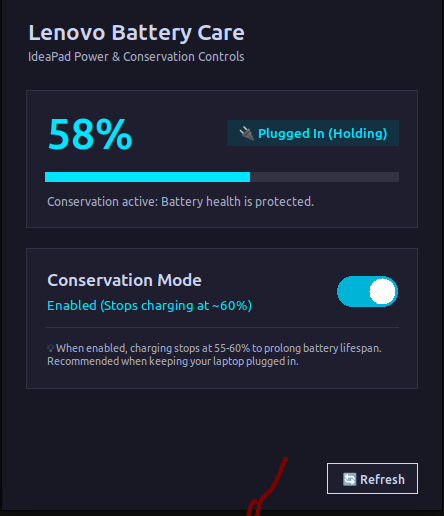

# Lenovo Battery Care 🔋🛡️

A lightweight, modern Linux GUI utility to monitor battery status and control **Lenovo Conservation Mode** on IdeaPad laptops.

<p align="center">
  
</p>

---

## 🌟 Features
- **Modern Dark UI:** Clean dark theme with smooth custom toggle switch.
- **Battery Health Preservation:** Toggles Conservation Mode (stops charging at ~60% to prolong battery lifespan).
- **Live Battery Monitoring:** Displays current battery percentage, status (Charging, Plugged In, On Battery), and visual level bar.
- **Native Authorization:** Uses Linux Mint / Ubuntu's official Polkit (`pkexec`) graphical prompt when toggling—no unsafe sudoers modifications required.
- **Enforced Auto-Refresh:** Multi-stage background sync to give laptop Embedded Controller (EC) hardware time to reflect charging state changes.
- **Desktop Integration:** Includes custom vector SVG icon and `.desktop` launcher for Cinnamon / GNOME Start Menu and Taskbar.

---

## 🚀 Installation & Usage

### One-line Automated Install:
```bash
./install.sh
```
Or directly from GitHub:
```bash
curl -sSL https://raw.githubusercontent.com/bayoumi/lenovo-battery-manager/main/install.sh | bash
```

### Manual Run:
```bash
python3 app.py
```

### Uninstallation:
```bash
./uninstall.sh
```

---

## 📁 Repository Structure
```text
lenovo-battery-manager/
├── app.py           # Main GUI application (Python 3 + Tkinter)
├── assets/
│   └── screenshot.png # App screenshot
├── icon.svg         # High-resolution vector icon
├── install.sh       # Automated installer script
├── uninstall.sh     # Clean uninstaller script
├── LICENSE          # MIT License
└── README.md        # Documentation
```

---

## ⚖️ License
MIT License © 2026 Bayoumi
